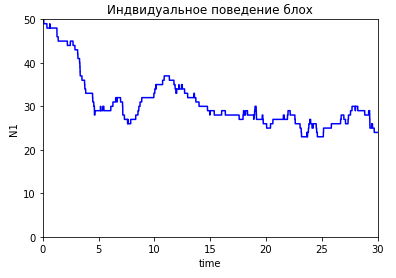

### Проект по моделированию распространения блох на двух собаках по модели Эренфестов.

- Решена задача распределения блох на двух собаках. Было получено, что:
    - Относительная разность числа блох на собаках имеет порядок малости N^(-1/2)
    - Математическое ожидание времени первого возвращения в начальное состояние равное 2^N
- Численно смоделировано движение блох на двух разных интерпретациях модели Эренфестов. 
- Построена модель Фика диффузии газов. Путем наложения графиков было проверено, что методы имеют похожие выводы.

Примеры результатов работы модели:

 

- Теоретические выкладки в **.pdf** файле
- Реализация в **.ipynb** файле
- Анимация сравнения модели Эренфестов с н моделью Фика в **.gif** файле

